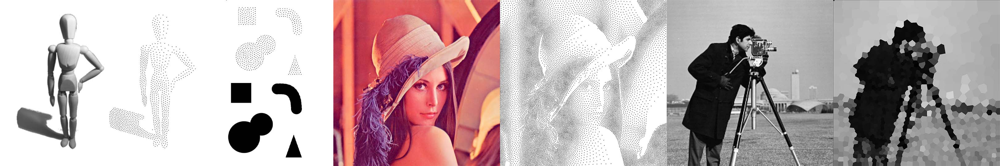
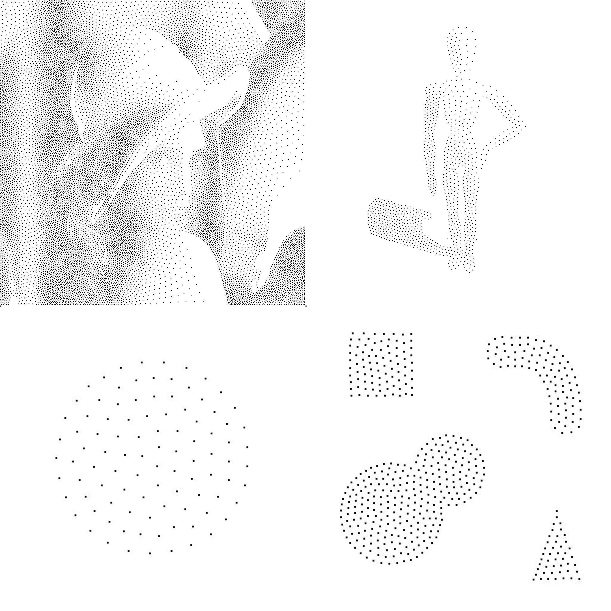
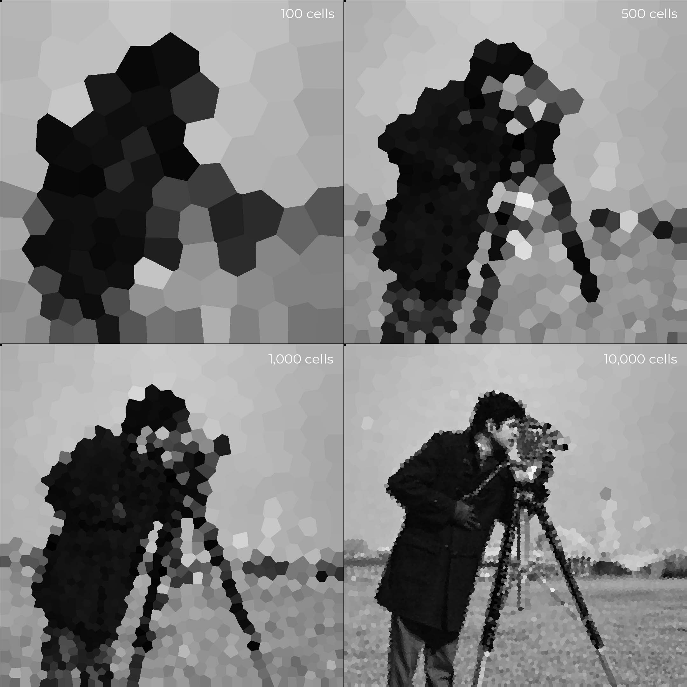

# Weighted Voronoi Point Stippling

An implementation of [*Weighted Voronoi Point Stippling*](https://www.cs.ubc.ca/labs/imager/tr/2002/secord2002b/secord.2002b.pdf) in Rust along with some additional functionality.



# Running the program

To run with default/assumed parameters:
```
cargo run --release image_path
```
To run with declared parameters
```
cargo run --release image_path point_count iterations threshold
```

## Where

| parameter | Definition | Default Value |
| --------- |--| :-------------: |
| image_path | path to weight image including extension | N/A |
| point_count | target number of seed points | calculated from weight image |
| iterations | number of relaxation iterations | 60 |
| threshold | maximum grayscale threshold at seed location | 0.5 |


## Example point relaxation images



## Example voronoi cell mosaics

